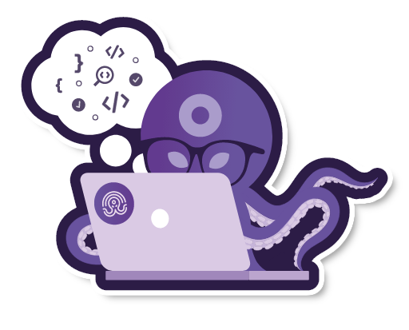
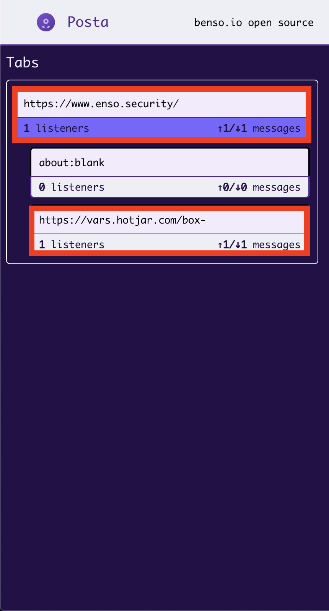
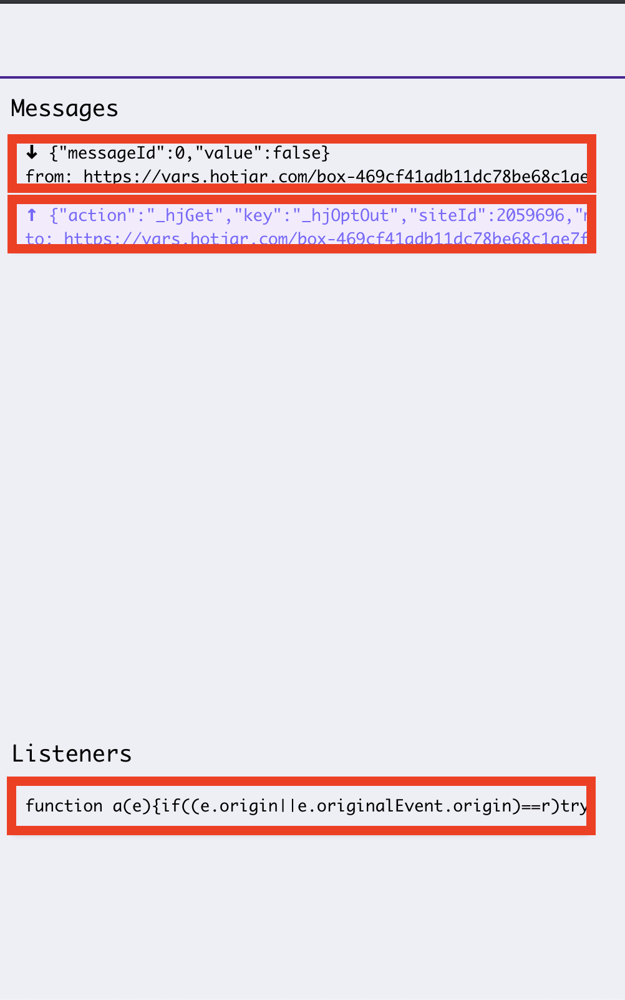
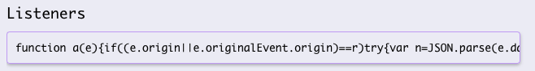
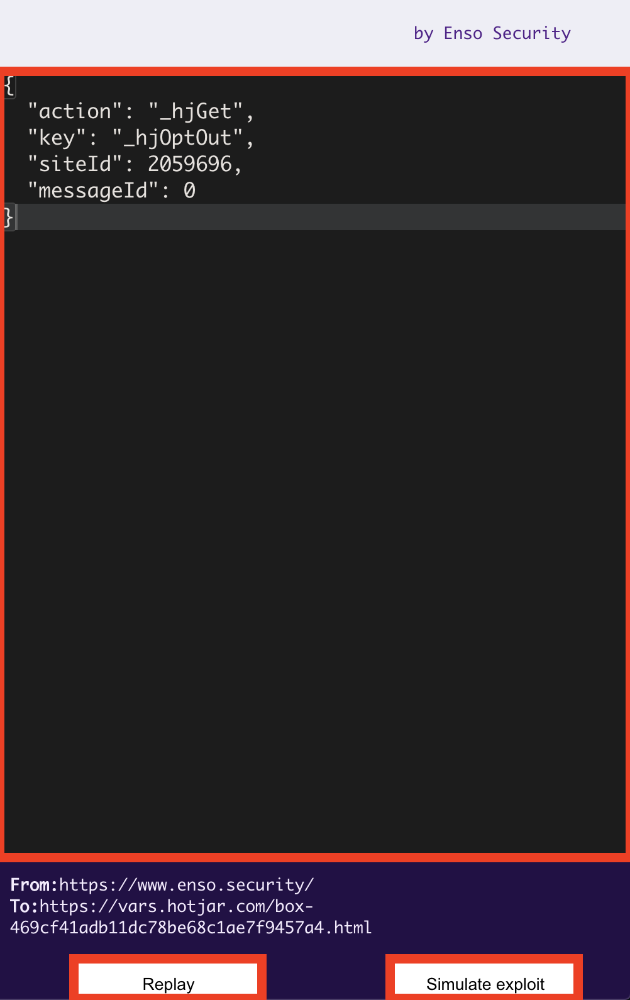

# Posta

<p align="center"><a href="https://github.com/benso-io/posta" title="Posta"></a></p>

**Posta** is a tool for researching `postMessage` communication. It allows you to track, explore and exploit `postMessage` vulnerabilities, and includes features such as replaying messages sent between windows within any attached browser.


## Prerequisites
* Google Chrome / Chromium
* [Node.js](https://nodejs.org/en/download/) (optional)

## Installation

### Development Environment

Run Posta in full dev environment with dedicated browser (Chromium)

1. Install Posta

```bash
git clone https://github.com/benso-io/posta
cd posta
npm install
```

2. Launch the dedicated chromium session with the following command
```bash
node posta <URL>
```
3. Click on the Posta extension to be navigated into the UI

### Chrome Extension
Run Posta as a Chrome / Chromium Extension

1. Clone the repo

```bash
git clone https://github.com/gourarie/post-apocalypse.git
```
2. Navigate to chrome://extensions/
3. Make sure "Developer mode" is enabled
4. Click on "Load unpacked"
5. Choose the "chrome-extension" folder inside Posta and upload it to your browser.
6. Load the extension
7. Pin the extension to your browser
8. Browse to the website you would like to examine
9. Click on the Posta extension to be navigated into the UI

## Tabs
At the tabs section we can find our main origin, with the Iframes he hosts and communicates with through the session.
We can choose the specific frame by clicking on it, and observe the postMessages related to that frame only.



## Messages
In the *Messages* section, we can inspect all `postMessage` traffic being sent from the origin to its iframes, and vice versa.
We can select specific communication for further examination by clicking on it.
The 8Listeners* area presents the code which is in charge of handling the communication, we can click and copy its contents for JS code observation.




## Console

At the console sections, we can modify the original postMessage traffic, and replay the messages with the tampered values which will get sent from the Origin to it's Iframe.

We should make tests and see if we can affect the behaviour of the website by changing the postMessage content, If we manage to do so, It's time to try and exploit if from different origin, by Clicking the "Simulate exploit"




## Exploit

At the exploit page, Posta will try and host the specified origin as Iframe to initiate postMessage communication, Most of the time we won't be able to do so due to X-Frame-Options enabled on the origin website.

Therefore, In order to continue with our exploitation we will need to gain communication referance with our origin by initiating the window.open method, which is being done by clicking on "Open as tab"

We have the console to our right which will help us to modify and craft our specified payloads and test them in Cross Origin Communication, initiated by clicking on the "Exploit" Button.


# Authors
- Chen Gour Arie
- [Barak Tawily](https://quitten.github.io/)
- [Gal Nagli](https://github.com/NagliNagli)
- Omer Yaron
