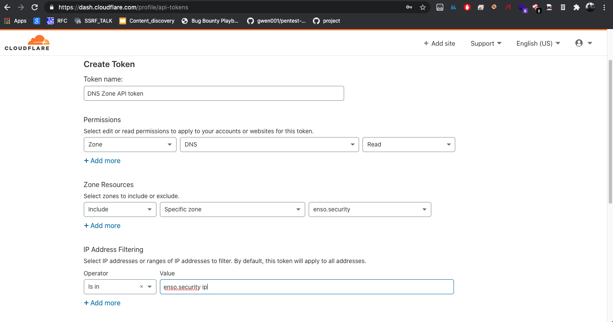

# Cloudflare DNS Collector

<br /><p align="center"></a></p>


## Prerequisites
In order for our DNS Collector CloudFlare collector to function correctly we will need DNS Zone Read only API token from the customer

## API Key Creation

1. Navigate to https://dash.cloudflare.com/profile/api-tokens
1. Click on "Create Token"
1. Use the "Edit zone DNS" template
1. Use the following permissions like the image below:
   * ZONE DNS Read
   * Include Specific Zone with the specified TLD
   * IP Address filtering (optional)
1. Click on "Create Token"
   
<br /><p align="center"></a></p>   

## Zone ID
We can locate the Zone ID by issuing the following API call
```javascript
curl https://api.cloudflare.com/client/v4/zones/ -H "Authorization: Bearer TOKEN"   -H "Content-Type: application/json"
```


## API call
The Api call should look like the following, when the Bearer should be the token supplied to us
```javascript
"curl https://api.cloudflare.com/client/v4/zones/ZONE_ID/dns_records" -H "Authorization: Bearer TOKEN"   -H "Content-Type: application/json"
```
