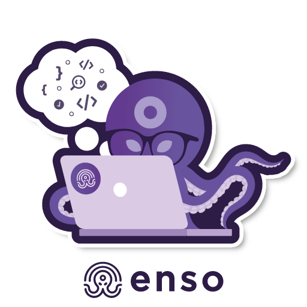

# Posta

<p align="center"><a href="https://github.com/benso-io/posta" title="Posta"></a></p>

**Posta** is a tool for researching `postMessage` communication. It allows you to track, explore and exploit `postMessage` vulnerabilities, and includes features such as replaying messages sent between windows within any attached browser.


# Install
There are 2 options to install Posta and getting started with our postMessage tracking journey.

## Development Environment

### Prerequisites
[Node.js](https://nodejs.org/en/download/) is required to be installed for this option

Run Posta in full dev environment with dedicated browser (Chromium)

```bash
1. git clone https://github.com/benso-io/posta
2. cd posta
3. npm install
```

## Chrome Extension
Run Posta as a Chrome Extension

```bash
1. git clone https://github.com/gourarie/post-apocalypse.git
```
2. navigate to chrome://extensions/
3. Click on "Load unpacked"
4. Choose the "chrome-extension" folder inside Posta and upload it to your browser.

# How to use - Dev environment
1. Launch the dedicated chromium session with the following command
```bash
node posta <URL>
```
2. Click on the Posta extension to be navigated into the UI

# How to use - Chrome Extension
1. Load the extension
2. Pin the extension to your browser
3. Browse to the website you would like to examine
4. Click on the Posta extension to be navigated into the UI

## Tabs


At the tabs section we can find our main origin, with the Iframes he hosts and communicates with through the session.

We can choose the specific frame by clicking on it, and observe the postMessages related to that frame only.

## Messages


At the messages section, we can inspect the entire postMessage traffic which is being sent from the origin to it's Iframes, and the opposite way.

We can select specific communication for further examination by clicking on it.

The Listeners area presents the code which is in charge of handeling the communication, we can click and copy it's contents for the JS code observation.

## Console


At the console sections, we can modify the original postMessage traffic, and replay the messages with the tampered values which will get sent from the Origin to it's Iframe.

We should make tests and see if we can affect the behaviour of the website by changing the postMessage content, If we manage to do so, It's time to try and exploit if from different origin, by clicking the "Simulate exploit"

## Exploit


At the exploit page, Posta will try and host the specified origin as an `iframe` to initiate `postMessage` communication. Most of the time we won't be able to do so due to Strict X-Frame-Options being enabled on the origin website.

Therefore, in order to continue with our exploitation we will need to gain communication referance with our origin by initiating the `window.open` method, which is done by clicking on "Open as tab".

We have the console to our right which will help us modify and craft our specified payloads and test them in Cross-Origin Communication, initiated by clicking on the "Exploit" button.

# Authors
- Chen Gour Arie
- [Barak Tawily](https://quitten.github.io/)
- [Gal Nagli](https://github.com/NagliNagli)
- Omer Yaron
